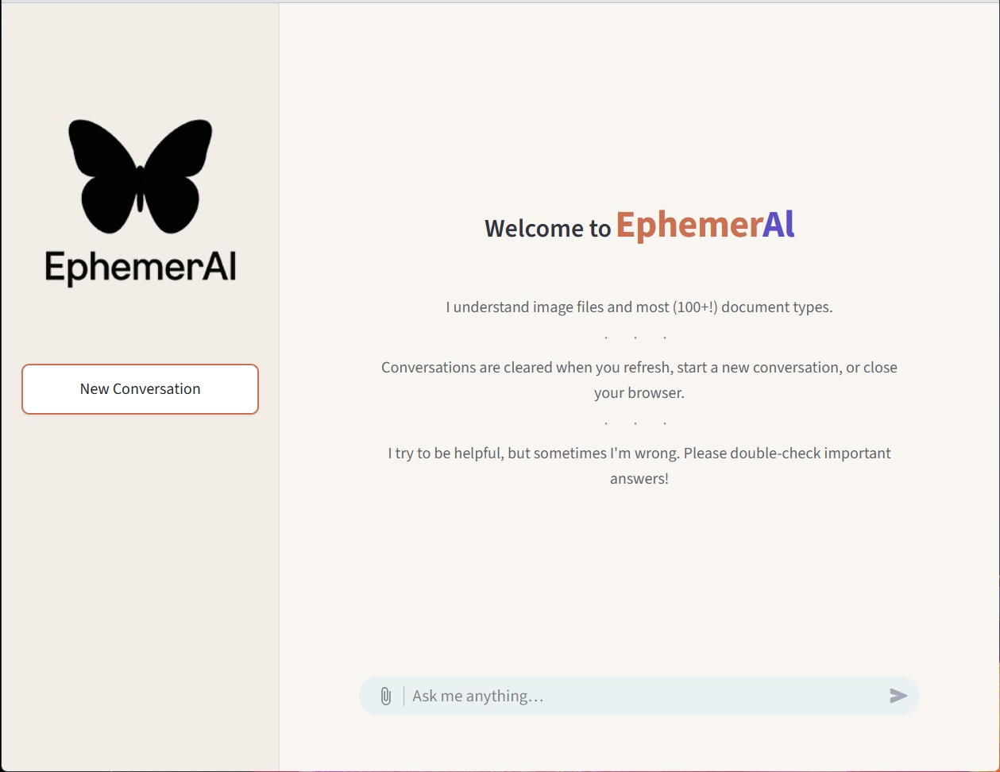

# EphemerAl

EphemerAl is a privacy-focused, self-hosted document chat app that runs local models through Ollama.

> Screenshot shows the default product branding; deployers can replace it via APP_DISPLAY_NAME and APP_LOGO_PATH.

## What this app does

- Runs chat against a local Ollama model with token-streamed responses.
- Supports document uploads (for example PDF, DOCX, TXT) and parses them with Apache Tika.
- Keeps session state in memory for the active Streamlit session.
- Applies streaming-output filtering as defense-in-depth for thought-channel leakage.

## Privacy and security summary

- Local-first architecture: app, model backend, and parser run in your environment.
- No app database by default; chat state is session-scoped in memory.
- Docker defaults keep Ollama internal to the Compose network unless explicitly exposed.
- **Ollama cloud features are disabled by default** with `OLLAMA_NO_CLOUD=1`.
- This stack is intended for trusted environments; if you expose it beyond a trusted network, add authentication and TLS via a reverse proxy.

## Quick start

Set expectations first:

- The public default profile (`qwen3:8b`, 32K context) is **text-only**.
- Document uploads work with the default profile.
- Image analysis requires a **vision-capable model** and (if auto-detection is insufficient) setting `LLM_SUPPORTS_VISION` appropriately.

Then:

1. **Pick a profile** from [`docs/model-profiles.md`](docs/model-profiles.md).
2. **Choose Compose mode**:
   - CPU/low-end (default): `docker compose up -d --build`
   - GPU/high-VRAM: `docker compose -f docker-compose.yml -f docker-compose.gpu.yml up -d --build`
3. **Run setup wizard or bootstrap**:
   - Wizard: `python scripts/setup_wizard.py`
   - Bootstrap: `bash scripts/bootstrap.sh`
4. **Create model alias** (recommended path):
   - `bash scripts/create_ollama_model.sh`
5. **Run doctor**:
   - `python scripts/doctor.py`
6. **Open the app**:
   - `http://localhost:8501`

## System requirements

The public default profile in this repository is **`qwen3:8b` with 32K context**. Use profile docs for exact environment values and tuning.

- **Low tier (entry):** modern CPU with limited or no discrete GPU.
  - Expect functional text chat and document workflows with higher latency.
- **Mid tier (recommended general use):** discrete GPU system suitable for local 8B-class inference.
  - Expect smoother text chat with the default `qwen3:8b` / 32K profile.
- **High tier (workstation):** high-VRAM multi-GPU or equivalent class hardware.
  - The current **Qwen35/256K** setup is a **high-VRAM workstation profile**, not the universal default.

For image support on any tier, choose a **vision-capable model** and verify capability detection/settings.

## Configuration

See [`docs/configuration.md`](docs/configuration.md).

Use `.env` (copied from `.env.example`) as the main configuration surface for deployment customization. Normal deployment customization should be done through config values, not source edits. `.env` is parsed as standard dotenv-style `KEY=VALUE` text (including values with spaces); it does not need to be shell-source-safe.

## Model profiles

See [`docs/model-profiles.md`](docs/model-profiles.md) for profile selection and tuning guidance.

## Customizing branding and system prompt

Common environment variables:

- `APP_DISPLAY_NAME`: user-facing product name shown in UI.
- `APP_LOGO_PATH`: logo path used by the app.
- `APP_EXPORT_TITLE`: title used in exported transcripts.
- `SYSTEM_PROMPT_PATH`: optional path to a custom system prompt file.

## Health check and troubleshooting

Use the doctor documentation and command:

- [`docs/doctor.md`](docs/doctor.md)
- `python scripts/doctor.py`

GPU support is preserved through the explicit `docker-compose.gpu.yml` override path; base `docker-compose.yml` remains CPU-safe for low-end installs.

## Optional shared Ollama API

- Default Compose deployment keeps raw Ollama internal.
- Raw API exposure is a manual opt-in via `docker-compose.api.yml`.
- Keep `OLLAMA_API_BIND=127.0.0.1` as the safer default when using that override, and widen only intentionally.
- **Security warning:** exposing raw Ollama does not add app-layer authentication automatically.

## Development and testing

From repository root:

- `python -m pytest -q`
- `pytest -q`
- `python -m py_compile ephemeral_app.py ephemeral/*.py`
- `ruff check .`

Optional checks:

- `bash scripts/validate.sh`
- `python scripts/ui_smoke.py`
- `bash scripts/validate_ui.sh`

## License

This repository’s code is licensed under the [MIT License](LICENSE.md). Third-party components, container images, and model weights are licensed separately by their respective owners.
